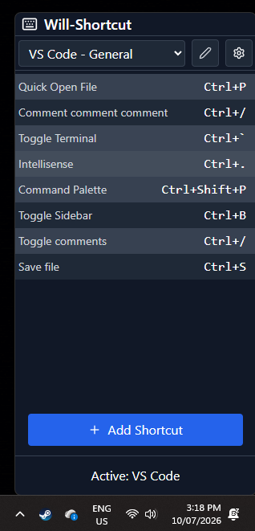
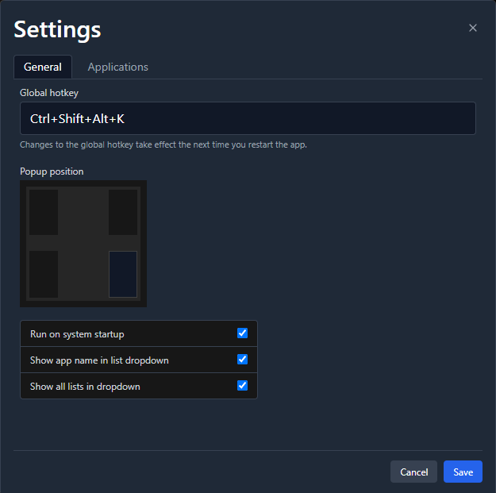
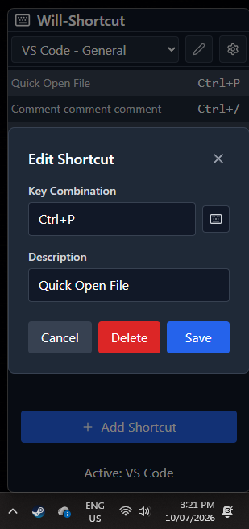

# Will-Shortcut

<div align="center">


**A quick-reference keyboard shortcut overlay for Windows**

*Never forget your shortcuts again. Access them instantly with a global hotkey.*

[](https://tauri.app/)
[](https://reactjs.org/)
[](https://www.typescriptlang.org/)
[](LICENSE)

</div>

---

## 📖 About

**Will-Shortcut** is a lightweight desktop application that provides instant access to keyboard shortcuts for your favorite applications. Built with Tauri, React, and TypeScript, it combines the performance of Rust with the flexibility of modern web technologies.

### ✨ Key Features

- 🎯 **Quick Access** - Summon the shortcut overlay instantly with a customizable global hotkey
- 📱 **App-Aware** - Automatically detects your active application and shows relevant shortcuts
- 🎨 **Clean Interface** - Minimalist, always-on-top window that stays out of your way
- ✏️ **Fully Customizable** - Create, edit, and organize shortcuts for any application
- 📋 **Multiple Lists** - Organize shortcuts into themed lists (e.g., Navigation, Editing, Git)
- 🚀 **Autostart Support** - Launch automatically on system startup
- 💾 **Persistent Storage** - Your shortcuts are saved and synced across sessions

---

## 📸 Screenshots

### Main Popup Window

*Quick-access popup showing keyboard shortcuts for the active application*

### Settings Window

*Configure global hotkey, window position, and autostart preferences*

### Add/Edit Shortcuts

*Easy-to-use modal for creating and editing shortcuts*

---

## 🚀 Getting Started

### Prerequisites

Before building Will-Shortcut, ensure you have the following installed:

- **Node.js** (v16 or higher) - [Download](https://nodejs.org/)
- **Rust** (latest stable) - [Install via rustup](https://rustup.rs/)
- **pnpm** or **npm** - Package manager

### Installation & Setup

1. **Clone the repository**
   ```bash
   git clone https://github.com/yourusername/Will-Shortcut.git
   cd Will-Shortcut
   ```

2. **Install dependencies**
   ```bash
   npm install
   ```

3. **Run in development mode**
   ```bash
   npm run tauri dev
   ```

4. **Build for production**
   ```bash
   npm run tauri build
   ```
   The installer will be generated in `src-tauri/target/release/bundle/`

---

## 🛠️ Development

### Recommended IDE Setup

- [Visual Studio Code](https://code.visualstudio.com/)
- [Tauri Extension](https://marketplace.visualstudio.com/items?itemName=tauri-apps.tauri-vscode)
- [rust-analyzer](https://marketplace.visualstudio.com/items?itemName=rust-lang.rust-analyzer)

### Project Structure

```
Will-Shortcut/
├── src/                    # React frontend source
│   ├── components/         # React components
│   ├── hooks/             # Custom React hooks
│   ├── types/             # TypeScript type definitions
│   └── utils/             # Utility functions
├── src-tauri/             # Tauri backend (Rust)
│   ├── src/               # Rust source code
│   └── icons/             # Application icons
└── public/                # Static assets
```

### Tech Stack

- **Frontend**: React 19, TypeScript, Tailwind CSS
- **Backend**: Tauri 2.0, Rust
- **UI Components**: Lucide React icons
- **Drag & Drop**: @dnd-kit library
- **Build Tool**: Vite

### Available Scripts

```bash
npm run dev          # Start Vite dev server
npm run build        # Build frontend
npm run tauri dev    # Run Tauri app in development
npm run tauri build  # Build production executable
```

---

## 💡 Usage

1. **Launch the app** - Will-Shortcut runs in the system tray
2. **Press the global hotkey** (default: `Ctrl+Shift+K`) to open the popup
3. **View shortcuts** for your currently active application
4. **Add custom shortcuts** using the "+" button
5. **Organize with lists** - Create multiple lists per application (e.g., "General", "Navigation", "Editing")
6. **Configure settings** - Click the gear icon to customize hotkeys, position, and startup behavior

### Managing Shortcuts

- **Add**: Click the `+` button or right-click → "Add shortcut above/below"
- **Edit**: Click on a shortcut or right-click → "Edit"
- **Delete**: Right-click → "Delete"
- **Reorder**: Right-click → "Move up/down" or drag and drop

---

## ⚙️ Configuration

Settings are accessible via the gear icon in the main popup or from the system tray menu.

### Available Settings

- **Global Hotkey** - Customize the key combination to open the popup
- **Window Position** - Set where the popup appears (top-left, top-right, etc.)
- **Autostart** - Launch automatically when Windows starts
- **Application Names** - Customize display names for detected applications

---

## 🤝 Contributing

Contributions are welcome! Please feel free to submit a Pull Request.

1. Fork the repository
2. Create your feature branch (`git checkout -b feature/AmazingFeature`)
3. Commit your changes (`git commit -m 'Add some AmazingFeature'`)
4. Push to the branch (`git push origin feature/AmazingFeature`)
5. Open a Pull Request

---

## 📝 License

This project is licensed under the MIT License - see the [LICENSE](LICENSE) file for details.

---

## 🙏 Acknowledgments

- Built with [Tauri](https://tauri.app/) - For making desktop apps with web technologies
- UI icons by [Lucide](https://lucide.dev/) - Beautiful, consistent icon set
- Inspired by the need for a quick keyboard shortcut reference tool

---

<div align="center">

**Made with ❤️ for productivity enthusiasts**

[Report Bug](https://github.com/AWilliamson88/Will-Shortcut/issues) · [Request Feature](https://github.com/AWilliamson88/Will-Shortcut/issues)

</div>
